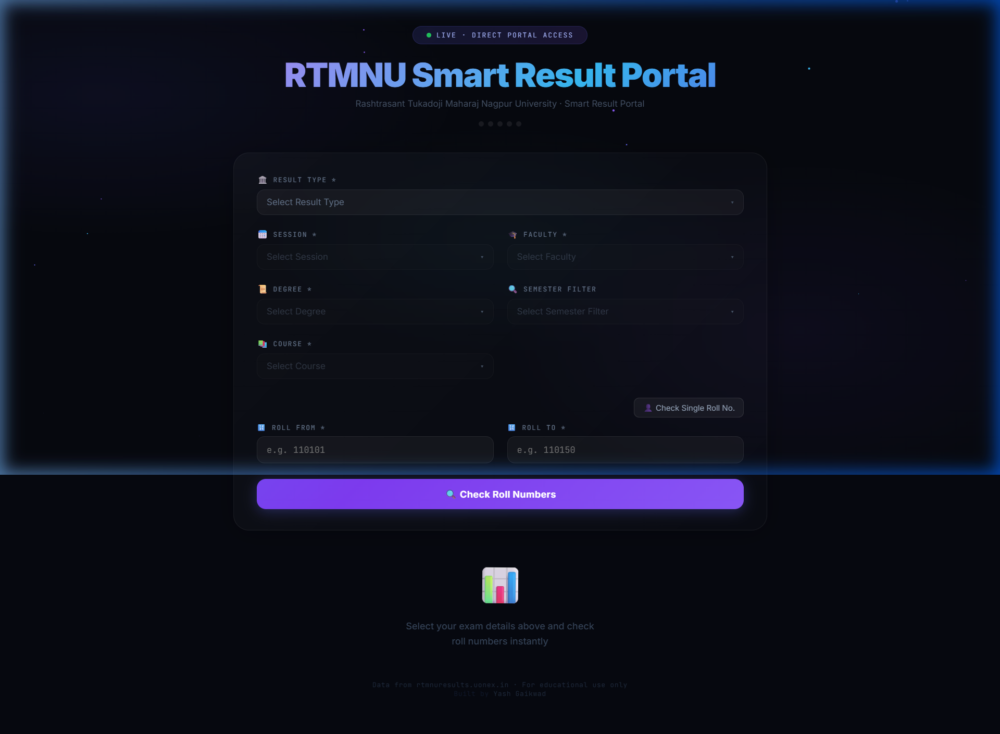
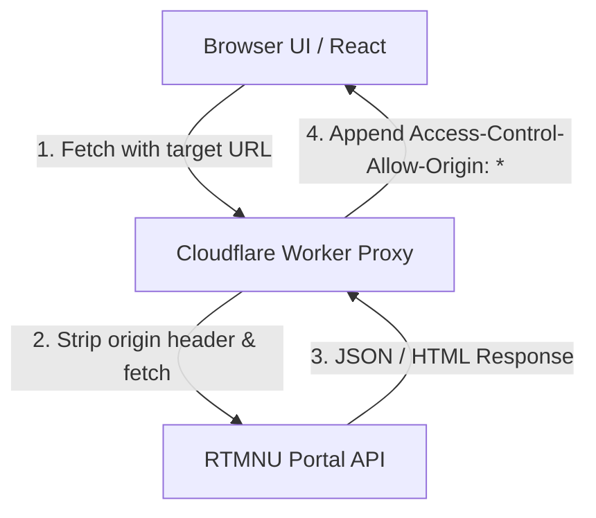

# RTMNU Smart Result Portal

A premium, high-fidelity client-side dashboard designed for bulk checking and analyzing student exam results from the Rashtrasant Tukadoji Maharaj Nagpur University (RTMNU) portal.



---

## 📖 Project Overview
Checking university results for entire classrooms or departments is typically a tedious process that involves entering individual roll numbers and submitting forms repeatedly. The **RTMNU Smart Result Portal** simplifies this by enabling bulk roll number checks, auto-grading using official Gazette listings, exporting results to spreadsheet formats (CSV), and viewing marksheets inside a modern dark glassmorphic web dashboard.

---

## ⚡ Features
- **Bulk Range Queries:** Fetch results for an entire range of roll numbers (e.g. 110101 — 110150) in a single run.
- **Single Roll Mode:** Toggle to check a single student's score instantly.
- **Smart Registration Filter:** Queries RTMNU's course lists to verify registered roll numbers before launching network requests, preventing empty or dead queries.
- **Auto-Grade via Gazette:** Paste plain text from official Gazette reports to match and assign PASS/FAIL status to students in milliseconds on the client-side.
- **Marksheet PDF Previews:** Inspect official student grade reports inside an inline modal iframe viewer without browser redirects.
- **Data Export:** Download query tables as clean CSV files for offline analysis in Excel or Google Sheets.
- **Proxy Network:** Uses a custom Cloudflare Worker serverless proxy and races public fallback proxies via `Promise.any` to resolve client-side CORS blocks.
- **Fast Session Cache:** Implements client-side session caching for cascading form dropdown lists to reduce page load latency.

---

## 🛠️ Tech Stack
- **Frontend Core:** HTML5, CSS3, and JavaScript (ES6+).
- **Framework & Rendering:** React 18 and React DOM (loaded via unpkg CDN).
- **Compiler:** Babel Standalone (loads React JSX dynamic scripts directly in browser, no local build tools required).
- **Icons & Web Fonts:** Google Fonts (Inter, JetBrains Mono).
- **Proxy Layer:** Cloudflare Worker (serverless proxy node).

---

## 📐 Architecture

The portal acts as a client-side Single Page Application (SPA) that routes requests to RTMNU's APIs through a proxy layer to bypass CORS restrictions.



---

## 🔌 API Flow Reference

Form selections cascade sequentially:
1. **Get Sessions:** User chooses `UNIVERSITY` or `AUTONOMOUS` Result Type. Portal requests `/Auth/GetDegreesBySession?department=[Type]`.
2. **Get Faculties:** Portal requests `/Auth/GetFacultyName?department=[Type]&session=[Session]`.
3. **Get Degrees:** Portal requests `/Auth/GetDegreesByFaculty?faculty=[FacultyID]&session=[Session]&department=[Type]`.
4. **Get Courses:** Portal requests `/Auth/GetCoursesByFacultyDegree?faculty=[FacultyID]&coursecode=[Degree]&session=[Session]&department=[Type]`.
5. **Get Roll Numbers:** Portal requests `/Auth/GetRollNumbers?coursecode=[CourseID]&department=[Type]`.
6. **Fetch Results:** Results and student marksheets are streamed by matching roll numbers and loading `/GetMarkSheet_report?rollno=[Roll]&session=[Session]&courseCode=[CourseID]&faculty=[FacultyID]&degree=[Degree]&department=[Type]`.

For detailed API definitions, see [docs/api_flow.md](docs/api_flow.md).

---

## 📁 Repository Folder Structure

```
├── index.html               # Master HTML entry point
├── LICENSE                  # MIT License
├── .gitignore               # Ignored system and temporary files
├── CHANGELOG.md             # Version milestone registry
├── CONTRIBUTING.md          # Development and commit guidelines
├── css/
│   └── style.css            # Stylesheet containing variables, transitions, layouts
├── js/
│   └── app.js               # Main React engine (hooks, API fetchers, rendering)
├── workers/
│   └── cloudflare-worker.js # CORS Serverless proxy utility
├── images/
│   └── screenshot.png       # Real browser screenshot showing active portal UI
└── docs/
    ├── project-overview.md  # Core business problem, solution, tech stack
    ├── architecture.md      # Detailed folder layout and component system
    └── api_flow.md          # Endpoint structures and parameters query flow
```

---

## 🚀 Installation & Running Locally

Since this project is a purely static website with zero dependencies, you don't need `npm install` or local node modules. 

1. **Clone the repository:**
   ```bash
   git clone https://github.com/Yash-Gaikwad14/rtmnu-result-checker.git
   cd rtmnu-result-checker
   ```

2. **Run a local HTTP server:**
   To avoid browser CORS blocks when loading the external React scripts locally, run a lightweight static file server:
   - **Python (Recommended):**
     ```bash
     python -m http.server 8000
     ```
     Then navigate to `http://localhost:8000`.
   - **VS Code:** Install the **Live Server** extension and click "Go Live".
   - **Node.js (Alternative):**
     ```bash
     npx serve
     ```

---

## 🌐 Serverless Proxy Deployment (Cloudflare Worker)

To run the portal reliably without hitting rate-limits on public CORS proxies:
1. Sign up for a free [Cloudflare Workers](https://workers.cloudflare.com/) account.
2. Create a new Worker.
3. Paste the contents of [workers/cloudflare-worker.js](workers/cloudflare-worker.js) into the editor.
4. Deploy the worker and copy your deployed URL (e.g. `https://my-proxy.name.workers.dev/`).
5. Open [js/app.js](js/app.js) and update the `CUSTOM_PROXY` variable:
   ```javascript
   const CUSTOM_PROXY = "https://my-proxy.name.workers.dev/?url=";
   ```

---

## 📈 Future Improvements
- **Local Database Indexing:** Enable saving historical results runs using IndexedDB.
- **Pass/Fail Visual Charts:** Render interactive pie-charts detailing grading distributions in the UI.
- **Scraper workers:** Move scraping routines into Cloudflare cron triggers to run background indexing of RTMNU releases.
