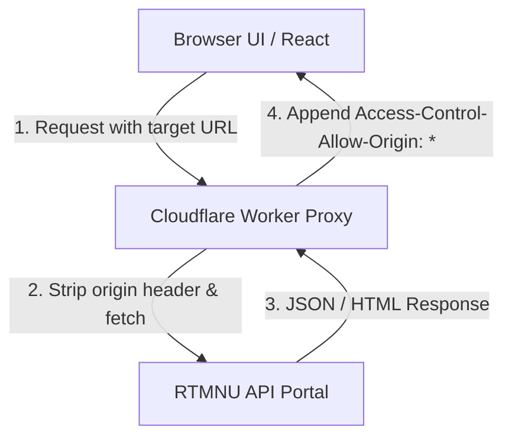

# Project Overview - RTMNU Smart Result Portal

This document outlines the core business context, user problems, technical solutions, and architecture of the **RTMNU Smart Result Portal**.

---

## 1. Problem Statement
The official Rashtrasant Tukadoji Maharaj Nagpur University (RTMNU) results page (`rtmnuresults.uonex.in`) poses several challenges for students and educators:
- **Lack of Bulk Lookup:** Results can only be checked one roll number at a time, requiring repetitive form submissions. This is highly inefficient for college administrators, teachers, and student groups checking scores for entire classes.
- **Slow Interface & Heavy Assets:** The portal is slow and heavy, leading to frequent timeouts during high-traffic result releases.
- **No Summary Statistics:** Administrators cannot easily view cumulative pass/fail counts or export class summaries.
- **CORS Limitations:** Third-party applications cannot query the result APIs directly due to strict Cross-Origin Resource Sharing (CORS) blocks, making automation difficult.

---

## 2. The Solution
The **RTMNU Smart Result Portal** is a high-fidelity, client-side application designed to solve these issues:
- **Bulk Range Queries:** Enables querying contiguous sequences of roll numbers (e.g. 110101 to 110150) in a single action.
- **Intelligent Filtering:** Instantly filters active student listings based on RTMNU database registrations before fetching, eliminating empty queries.
- **Gazette Auto-Grading:** Allows administrators to paste official Gazette text summaries and auto-match grade outcomes (PASS/FAIL/GRACE) to the list in milliseconds.
- **Marksheet PDF Previews:** Embeds inline iframe previews of original marksheet PDFs, enabling one-click view without reloading the portal.
- **Data Portability:** Includes a one-click CSV export for offline analysis in Microsoft Excel or Google Sheets.

---

## 3. Tech Stack
The portal leverages a zero-build, static web technology stack that is lightweight, highly portable, and serverless:
- **Frontend Framework:** [React 18](https://react.dev/) loaded via unpkg CDN, compiled on the fly using [Babel Standalone](https://babeljs.io/docs/en/babel-standalone) for modern ES6+ and JSX compatibility.
- **Styling:** Custom vanilla CSS style tokens, using glassmorphic UI components, smooth keyframe transitions, and a dark space-mesh aesthetic.
- **Serverless CORS Proxy:** A custom [Cloudflare Worker](https://workers.cloudflare.com/) proxy that intercepts client requests, strips browser CORS headers, and forwards requests to the official RTMNU backend.
- **Client Cache:** `sessionStorage` caching for cascading dropdown queries to avoid redundant payloads.

---

## 4. Architecture Overview
The portal is designed as a client-side Single Page Application (SPA) communicating with the RTMNU API via proxy nodes.

---

## 5. Engineering Challenges & Mitigations

### Challenge 1: CORS Protection on RTMNU
- **Problem:** Browsers block requests from third-party domains.
- **Mitigation:** The application uses a custom Cloudflare Worker proxy to act as a bridge. For resilience, it implements a `Promise.any` race strategy over several public CORS proxies as fallback nodes.

### Challenge 2: Mobile Iframe Caching
- **Problem:** Mobile browsers aggressively cache PDF iframes, resulting in old student marksheets rendering inside the preview modal.
- **Mitigation:** Implemented a randomized cache-buster query parameter (`_t` and `rand`) and a 150ms timeout window to ensure the browser fully recreates the iframe document context.

---

## 6. Future Scope
- **Offline Mode:** Use local storage cache to store historical class runs permanently.
- **Visual Analytics:** Add chart graphics (pie charts, bar charts) displaying pass/fail percentages and grade distribution directly in the UI.
- **Serverless Scraper Pipeline:** Migrate scraping logic into worker cron schedules to preemptively build search databases for class outcomes.
